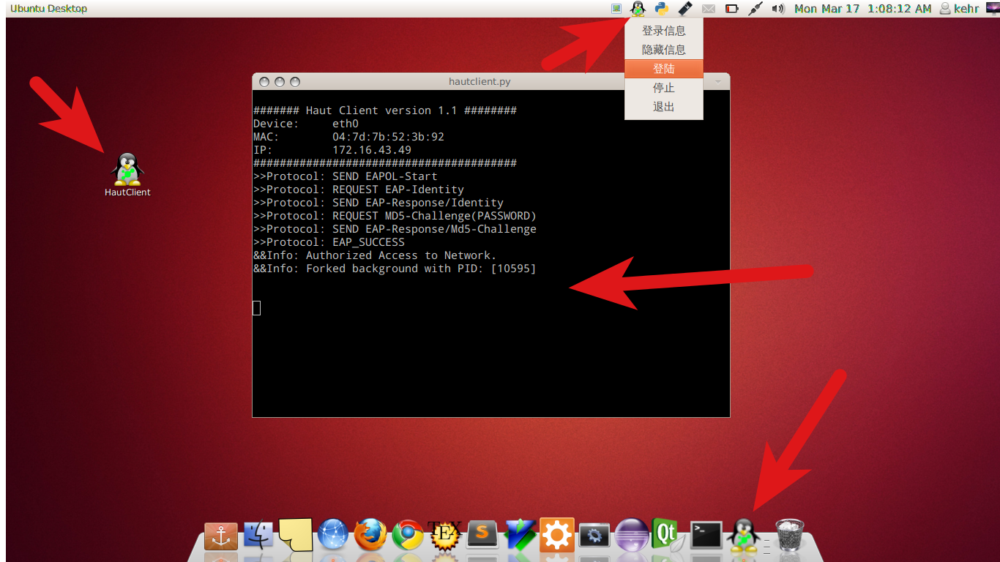

#介绍
-----

HautClient，这个项目是我在课余时间编写的 **河南工业大学** 校园网认证客户端的 **Linux** GUI 版本。

我们学校没有 Linux 和 Mac 版本的客户端，这让我们这些用 Linux 的小伙伴和其他用 mac 的小土豪们着实难过～。以至于用 Linux 的只能用无线上网，用 Mac 的只好装了 Windows (好纠结的决定！)。不过后来有一天我发现了 zlevoclient 这个开源项目，解决了燃眉之急。用过一段时间后发现程序还有待完善的地方，当时决定做一个 GUI 版本。于是便有了现在这个项目。

用到了两个开源项目：

1. [zlevoclient][1]  
由PT桑开发，实现了一个第三方的supplicant客户端，兼容联想的802.1x协议校园网认证系统，支持在Unix系操作系统下跨平台使用。该项目为命令行版本，在湖南人文科技学院、河南工业大学、吉林大学珠海学院，测试完成。  
我下载并编译了该项目并修改部分源码，增加判断当前网络连接状态功能。
2. [Goagent][2]  
作为我朝程序员，对它应该很熟悉，不再介绍。用 goagent 的时候，发现它的设计思路让我眼前一亮，和我想要实现的效果几乎一样，完全可以用来包装第一个项目（zlevoclient），写一个GUI版本。于是乎，看了源码，我就实现了现在这个项目：HautClient。

当然，在此之前我也做过其它的两个版本的实现。第一版，用 python+Tkinter 实现了基本的 UI 界面，但是交互性不好，而且线程没有处理好，会出现界面卡死情况。第二版，用 python + pyGTK模仿 Windows 下的登陆情况实现完整的UI，可以正常的使用，但是安装配置等过于繁琐，前台UI和后台的登陆之间的的交互处理的过于简单，程序面临这很多的问题。现在你看到的是第三版，这个版本完全没有前两个版本的缺点，安装成功后，和使用 goagent 一样方便。


#配置
-----

##1. Ubuntu 

配置 python 环境，和 UI 库。如果你已经配置过 GoAgent 则可跳过此步骤

```bash
sudo apt-get install python-dev python-gevent python-vte python-appindicator

```

配置libpcap编译环境

```bash
sudo apt-get install flex bison
```

安装 expect, 使用这个'工具'实现免密码登陆。

```bash
sudo apt-get install expect
```

配置登录信息。修改 `extend` 目录下的 `info.ini` 文件，按照文件中的提示配置你登陆的用户名和密码，还有当前用户的密码。

##2. Mac

正在测试 ...

#安装
----

在你需要保存 HautClient 的位置，打开终端，输入一下命令：

```bash
git clone https://github.com/kehr/HautClient.git
```
```bash  
cd HautClient/
make
sudo make install
```

安装成功后，执行 `hautclient.py` 文件。双击文件，选择 `run`，即可完成登陆。

如果双击无法执行，则需在`hautclient.py`所在目录打开终端，执行以下命令：

```bash
python hautclient.py
```
完成登陆后，你还可以把客户端添加到开机启动项，每次开机后会自动连接认证。

双击 `auto-start.py` ，选择 `run`，即可完成操作。

或者在终端执行如下命令：

```bash
python auto-start.py
```

#卸载

在`Hautclient`所在目录打开终端，输入：

```
sudo make uninstall
```


#其它

程序刚写完，在自己和同学机器上做了简单的测试。安装和配置的过程可能还有问题，希望你能够参与测试。你可以把自己的测试结果以issue的形式提交，或者给我发邮件：<kehr.china@gmail.com>，我会及时给予回复。

如果配置过程出现问题，可以参考[zlevoclient][3] 和 [GoAgent][4] 的配置。

**测试说明:**

程序增加了检测网线是否插入的功能。网线未插入，运行后会在vte终端显示：

```
@ERROR: Network Offline!
@SUGGESTION: Please check the network cable is plugged.
```

测试需要插入网线才能看到认证信息。

只要能在vte终端显示正在认证的消息(如下), 测试即可完成。

```
######## Haut Client version 1.1 #########
Device:     eth0
MAC:        00:24:54:1a:d4:31
IP:         0.0.0.0
########################################
>>Protocol: SEND EAPOL-Start

```

[1]: https://code.google.com/p/zlevoclient
[2]: https://code.google.com/p/goagent
[3]:https://code.google.com/p/zlevoclient/wiki/StepByStep_Toturial
[4]: https://code.google.com/p/goagent/wiki/GoAgent_Linux
